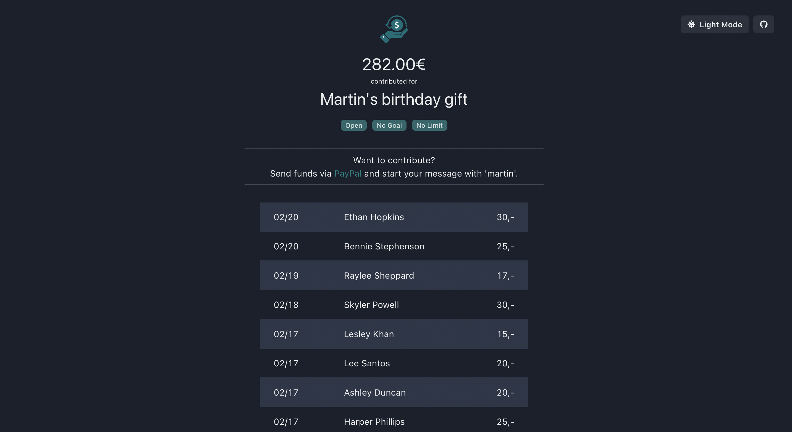

<h2 align="center">
PayPal Moneypool Alternative
  <br>
  <br>
  <a href="https://github.com/gsx95/georgguessr"></a>
</h2>

<h4 align="center">Tool to replace Paypal's moneypool with code-word driven pooling of personal PayPal funds.</h4>
<p align="center">
</p>

<p align="center">
  <a href="#key-features">Key Features</a> •
  <a href="#how-it-works">How It Works</a> •
  <a href="#how-to-use">How To Use</a> •
  <a href="#how-to-build">How To Build</a>
</p>
<p align="center">

</p>

## About

This project is a quick alternative to PayPal's discontinued moneypool feature. Everyone with a personal PayPal account can use this stack to host their own moneypools.

After creating a moneypool, whenever your friends includes a note starting with the moneypool's name when sending you PayPal funds, this tool automatically detects it and displays the contributions nicely on your website.

## Key Features

* Easy moneypools
  - friends can send you normal PayPal funds, they just need to let the "Note" field start with the moneypool's name
  - overview of every contribution with name and amount
  - displaying total sum of all contributions
  - embedded paypal.me link with instructions on how to contribute
 
* Easy, cheap and secure deployment
  - deployed in your AWS account
  - no data given to external parties whatsoever
  - deployed via AWS SAM
  - serverless deployment with most uses probably inside AWS free tier

* No hassle with other wallet providers
  - seamless integration into normal PayPal flow everyone already knows
  
## How it works

Because you cannot use PayPal's API with a _personal_ account, this tool uses a workaround to get notified of new transactions to your wallet. 

This is achieved by parsing the payment notification email PayPal sends to you after every transaction to your wallet, looking for an active moneypool's name in the note field, and displaying them on your website.

Note: This project is only meant for _personal_ PayPal accounts. Since business accounts have access to PayPal's API, you can use that to directly get your transactions, making this tool obsolete.


## How to use

Lets say you want to collect some money to buy your friend Paul a birthday gift. 

You [add a new moneypool](#add-a-new-moneypool) to this stack and tell your friends to send money to your private PayPal account and to start the 'Note' field of the transactions with 'paul'.

You and your friends can now check on _YOURDOMAIN.COM?mp=paul_ who contributed and how much you collected in total so far.

Its that easy!

## How to build

To clone and run this application, you'll need [AWS SAM CLI](https://docs.aws.amazon.com/serverless-application-model/latest/developerguide/serverless-sam-cli-install.html) and [GoLang >1.16](https://golang.org) installed on your machine. 

### Prerequisites

You have to setup a [verified domain](https://docs.aws.amazon.com/ses/latest/DeveloperGuide/receiving-email-verification.html) in AWS SES with an appropriate [MX record](https://docs.aws.amazon.com/ses/latest/DeveloperGuide/receiving-email-mx-record.html).

You also need to either point all of your PayPal notifications to this email address or configure a forwarding rule in your current mail provider. Either way, your SES mail needs to receive PayPal transaction notifications. You can easily change and swap your email settings in your PayPal account.
### Deploy to AWS

From your command line:

```bash
# Clone this repository
$ git clone git@github.com:gsx95/georgguessr.git

# Go into the repository
$ cd georgguessr
# build backend and infrastructure template
$ sam build
# deploy to your AWS account
$ sam deploy --guided

```

After deploying the stack, add your api endpoint and your generated api key to the `frontend/main.js` and upload the content of the `frontend` directory to your websites s3 bucket.

### Add a new moneypool

To add a new moneypool, you only have to create a new DynamoDB item in the 'Moneypools' table with 'name' field set to the codeword your friends need to start their transaction message with, and a 'title' field for a longer description of what the moneypool is intended for.

For example, if you want to collection money for your friend Pauls birthday, you create a new DynamoDB item with the name 'paul' and the title 'Birthday gift for paul'.

